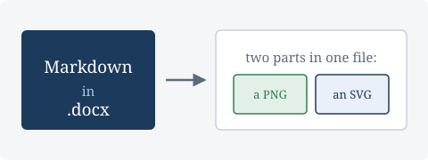

# Vectors



The picture above is an SVG, and it is in `19-vector.docx` **as a vector**. Word
scales it like one: zoom in and the arrowhead stays sharp, because the lines in
the file are numbers rather than pixels.

That is not the only way an SVG can go into a Word document, and it is worth
being precise about which way this one goes, because the other way looks
identical at 100% and is not.

## The two parts

Word has held SVG since 2016, and it holds it the only way it ever can: a raster
beside the vector, with the vector referenced from an extension on the same
picture element. Both go in:

| Part | What it is | Who draws it |
|------|------------|--------------|
| `word/media/….png` | a PNG of the diagram | Word 2007 and later, and anything that is not Word |
| `word/media/….svg` | the SVG you wrote | Word 2016 and later |

The raster is not a fallback in the sense of "used if nothing better is
available" — it is what **every** reader draws, including the new ones, unless it
knows to prefer the vector. A picture carrying the vector and no raster renders
*nothing at all*, in any version. So the PNG is not optional, and that is why an
SVG is rasterised on the way in rather than being handed over as-is.

Unzip `19-vector.docx` and both are there. The document part names the connection:

```
<a:blip r:embed="rId7">
  <a:extLst>
    <a:ext uri="{96DAC541-7B7A-43D3-8B79-37D633B846F1}">
      <asvg:svgBlip r:embed="rId8"/>
    </a:ext>
  </a:extLst>
</a:blip>
```

`rId7` is the PNG and `rId8` is the SVG. The `uri` is a fixed GUID, not a
namespace: a reader matches on that exact string and nothing else.

## Why the picture in this document is DrawingML

PHPWord writes images as VML — `w:pict`, `v:shape`, `v:imagedata` — and VML has
nowhere to hang an extension. So a picture with a vector is rewritten as
DrawingML, which is the form Word itself writes today. Every other image in every
other document keeps the markup PHPWord wrote, unchanged; only pictures that have
a vector are touched.

The alt text crosses with it. PHPWord keeps a description on VML as `o:title`
and DrawingML keeps it on `wp:docPr/@descr`, so moving between the two without
carrying it would delete the alt text — which is the part of a picture a screen
reader has. It is there:

```
<wp:docPr id="1" name="Picture 1" descr="The two parts of an SVG in a Word file"/>
```

## Without a rasteriser

Embedding an SVG needs something to make the PNG. This library uses
`ext-imagick`, and it is optional: where it is absent, an SVG raises and says so.

The message is worth reading in full, because it used to be wrong:

> Cannot embed "…/diagram.svg": Word can hold an SVG, but only beside a raster of
> it, so an SVG needs rasterising before it can go in — and this PHP has no SVG
> rasteriser, and without one there is no picture to put beside the vector.
> Install ext-imagick, or convert the file to PNG yourself.

It used to say that SVG "is not a format this library can put into a Word
document", which was false, and it listed the formats Word takes as though
excluding SVG were the answer. It was the rasteriser, not the format. A reader
sent to check whether Word supports SVG would have found that it does.

The other two outcomes are unchanged and are not this: a file that is not there
falls back to its alt text, and so does a remote URL, because the library has no
HTTP client and will not pretend a download happened.